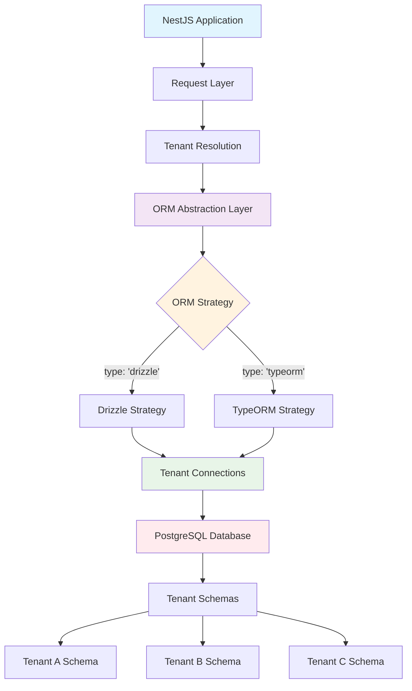
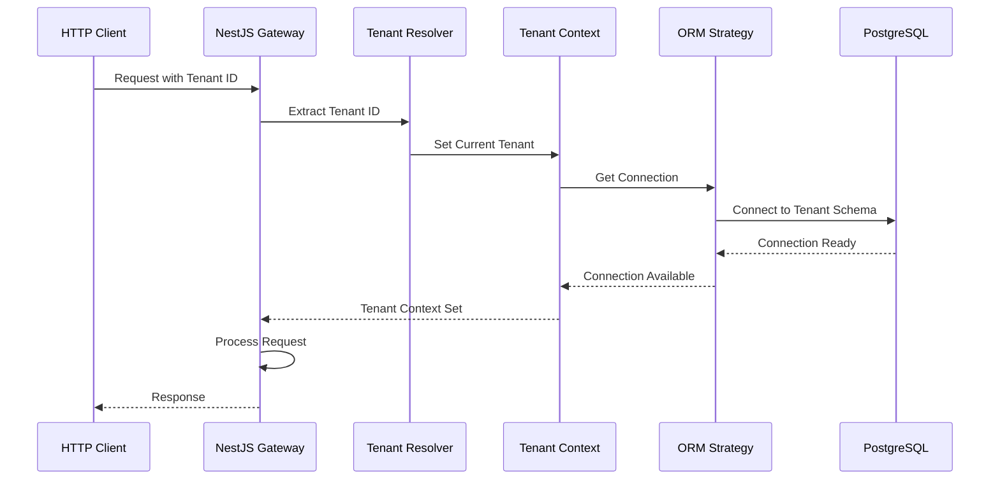
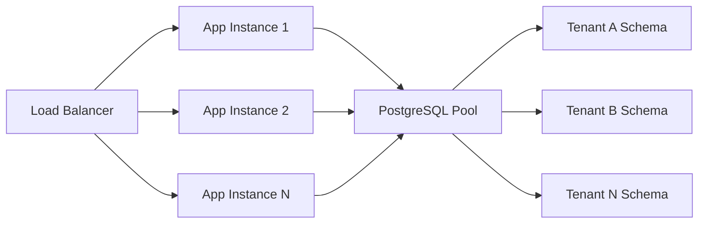

import Tabs from '@theme/Tabs';
import TabItem from '@theme/TabItem';

# Schema-per-Tenant Architecture

Understanding the multi-ORM architecture behind nestjs-multitenant and how it supports both TypeORM and Drizzle ORM seamlessly.

## Overview

Each tenant gets a dedicated PostgreSQL schema for complete data isolation. The package uses an ORM abstraction layer that supports both TypeORM and Drizzle ORM with minimal overhead.

## Core Architecture Diagram



## ORM Abstraction Layer

The abstraction layer provides a unified interface while allowing ORM-specific optimizations:

### Layer Components

1. **ORM Strategy Interface** (`IOrmStrategy`)
   - Defines connection management patterns
   - Enables seamless ORM switching
   - Provides type-safe connection handling

2. **Connection Interface** (`IOrmConnection`)
   - ORM-agnostic connection wrapper
   - Tenant-scoped database access
   - Unified API across ORMs

3. **Configuration System** (`OrmConfig`)
   - Centralized ORM configuration
   - Runtime ORM selection
   - Type-safe configuration validation

### Strategy Pattern Implementation

<Tabs>
  <TabItem value="drizzle" label="Drizzle Strategy">

```typescript
class DrizzleStrategy implements IOrmStrategy {
  type = 'drizzle' as const;

  async createConnection(tenantId: string): Promise<IDrizzleConnection> {
    // Create Drizzle connection with tenant-specific schema
    const db = drizzle(postgres(pool), { schema: this.schema });
    return new DrizzleConnection(db, tenantId);
  }

  validateConnection(connection: IDrizzleConnection): boolean {
    return connection.isConnected();
  }
}
```

  </TabItem>
  <TabItem value="typeorm" label="TypeORM Strategy">

```typescript
class TypeOrmStrategy implements IOrmStrategy {
  type = 'typeorm' as const;

  async createConnection(tenantId: string): Promise<ITypeOrmConnection> {
    // Create TypeORM connection with tenant-specific schema
    const dataSource = new DataSource({
      type: 'postgres',
      schema: tenantId,
      // ... configuration
    });
    return new TypeOrmConnection(dataSource, tenantId);
  }

  validateConnection(connection: ITypeOrmConnection): boolean {
    return connection.getDatabase().isInitialized;
  }
```

  </TabItem>
</Tabs>

## Data Isolation Model

### Schema-per-Tenant Benefits

| Aspect              | Schema-per-Tenant    | Database-per-Tenant | Row-Level Security |
| ------------------- | -------------------- | ------------------- | ------------------ |
| **Data Isolation**  | ⭐⭐⭐⭐⭐ Complete  | ⭐⭐⭐⭐⭐ Complete | ⭐⭐⭐⭐ Good      |
| **Performance**     | ⭐⭐⭐⭐⭐ Excellent | ⭐⭐ Good           | ⭐⭐⭐ Fair        |
| **Resource Usage**  | ⭐⭐⭐⭐ Efficient   | ⭐⭐ High           | ⭐⭐⭐⭐ Efficient |
| **Maintenance**     | ⭐⭐⭐⭐ Easy        | ⭐⭐ Complex        | ⭐⭐⭐⭐ Moderate  |
| **Backup Strategy** | ⭐⭐⭐⭐⭐ Simple    | ⭐⭐⭐⭐⭐ Simple   | ⭐ Complex         |

### Schema Structure

```sql
-- Each tenant gets their own schema
CREATE SCHEMA IF NOT EXISTS tenant_1;
CREATE SCHEMA IF NOT EXISTS tenant_2;
CREATE SCHEMA IF NOT EXISTS tenant_3;

-- Tables are created within each schema
CREATE TABLE tenant_1.users (
    id SERIAL PRIMARY KEY,
    name VARCHAR(255) NOT NULL,
    email VARCHAR(255) UNIQUE NOT NULL
);

CREATE TABLE tenant_2.users (
    id SERIAL PRIMARY KEY,
    name VARCHAR(255) NOT NULL,
    email VARCHAR(255) UNIQUE NOT NULL
);
```

## Request Flow

### Multi-Tenant Request Processing



### Step-by-Step Process

1. **Request Reception**: HTTP request arrives at NestJS application
2. **Tenant Resolution**: Extract tenant identifier from header/subdomain/query
3. **Context Setting**: Establish tenant context for the request lifecycle
4. **Connection Management**: ORM strategy creates tenant-specific connection
5. **Database Operations**: All operations use tenant-isolated connection
6. **Response**: Response sent with tenant context maintained

## Performance Considerations

### Connection Pooling

<Tabs>
  <TabItem value="drizzle" label="Drizzle ORM">

```typescript
// Drizzle uses efficient connection pooling
const pool = new Pool({
  connectionString: databaseUrl,
  max: 20, // Maximum connections
  idleTimeoutMillis: 30000,
});

const db = drizzle(pool, { schema: tenantSchema });
// Connections are reused across requests efficiently
```

  </TabItem>
  <TabItem value="typeorm" label="TypeORM">

```typescript
// TypeORM connection pool configuration
const dataSource = new DataSource({
  type: 'postgres',
  extra: {
    max: 20,
    idleTimeoutMillis: 30000,
    connectionTimeoutMillis: 2000,
  },
});
// Pool management handled by TypeORM
```

  </TabItem>
</Tabs>

### Performance Benefits

| Feature                 | Drizzle ORM           | TypeORM               |
| ----------------------- | --------------------- | --------------------- |
| **Query Execution**     | ⭐⭐⭐⭐⭐ Direct SQL | ⭐⭐⭐⭐ ORM overhead |
| **Memory Usage**        | ⭐⭐⭐⭐⭐ Minimal    | ⭐⭐⭐ Moderate       |
| **Connection Overhead** | ⭐⭐⭐⭐⭐ Low        | ⭐⭐⭐ Moderate       |
| **Type Safety**         | ⭐⭐⭐⭐⭐ Runtime    | ⭐⭐⭐⭐ Runtime      |

## Scalability Patterns

### Horizontal Scaling



## Security Architecture

### Isolation Guarantees

1. **Data Isolation**: Complete schema separation prevents data leakage
2. **Connection Isolation**: Each tenant has dedicated connection context
3. **Query Isolation**: All queries scoped to tenant schema
4. **Runtime Isolation**: Tenant context prevents cross-tenant access

### Security Best Practices

```typescript
// Automatic schema scoping prevents SQL injection
const user = await db
  .select()
  .from(users) // Automatically scoped to tenant schema
  .where(eq(users.id, userId));

// Generated SQL: SELECT * FROM "tenant_123"."users" WHERE id = $1
```

## Maintenance Patterns

### Schema Management

<Tabs>
  <TabItem value="drizzle" label="Drizzle Migrations">

```typescript
// Drizzle Kit for schema management
await drizzleKit.push({
  schema: tenantSchema,
  migrationsFolder: './drizzle',
  databaseUrl: tenantDatabaseUrl,
});
```

  </TabItem>
  <TabItem value="typeorm" label="TypeORM Migrations">

```typescript
// TypeORM migrations
await this.connection.runMigrations({
  transaction: 'each',
});
```

  </TabItem>
</Tabs>

### Backup Strategies

```bash
# Backup individual tenant schemas
pg_dump -h localhost -U postgres -d multitenant_db -n tenant_123 > tenant_123_backup.sql

# Restore tenant schema
psql -h localhost -U postgres -d multitenant_db < tenant_123_backup.sql
```

## Monitoring & Observability

### Connection Monitoring

```typescript
@Injectable()
export class ConnectionMonitorService {
  constructor(private connectionService: TenantConnectionService) {}

  async getConnectionMetrics(): Promise<ConnectionMetrics> {
    return {
      activeConnections: await this.connectionService.getActiveCount(),
      idleConnections: await this.connectionService.getIdleCount(),
      totalConnections: await this.connectionService.getTotalCount(),
      // Track per-tenant performance
    };
  }
}
```

### Performance Metrics

| Metric                    | Description                  | Monitoring Frequency |
| ------------------------- | ---------------------------- | -------------------- |
| **Connection Pool Usage** | Active vs idle connections   | Real-time            |
| **Query Response Time**   | Average query execution time | Per request          |
| **Tenant Isolation**      | Schema access verification   | Continuous           |
| **Resource Usage**        | Memory and CPU per tenant    | Periodic             |

## Future Architecture Considerations

### Extensibility

The ORM abstraction layer supports:

- **New ORM Support**: Easy addition of new ORM strategies
- **Hybrid Architectures**: Mixed ORM usage within same application
- **Dynamic ORM Switching**: Runtime ORM selection per tenant
- **Custom Strategies**: Customer-specific connection management

### Multi-Database Support

Future versions will support:

- **Database Sharding**: Automatic tenant distribution
- **Cross-Database Queries**: Analytics across tenants
- **Global Tables**: Shared configuration across tenants
- **Tenant Migration**: Move tenants between databases

This architecture provides a solid foundation for scalable, secure multi-tenant applications while maintaining flexibility and performance with both traditional (TypeORM) and modern (Drizzle) ORM approaches.
