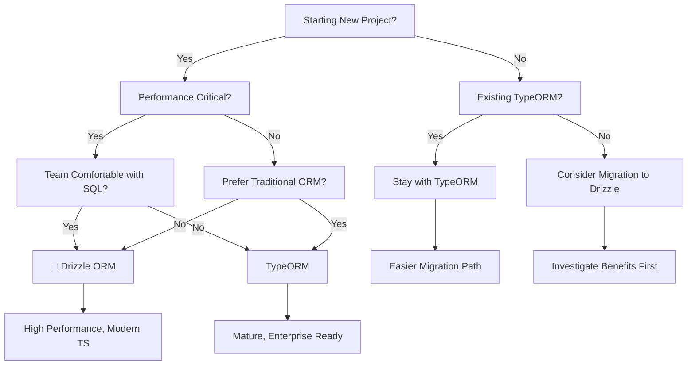

import Tabs from '@theme/Tabs';
import TabItem from '@theme/TabItem';

# ORM Comparison: Drizzle vs TypeORM

Choosing the right ORM is crucial for your multi-tenant application. Both Drizzle ORM and TypeORM are excellent choices with different strengths and trade-offs.

## Quick Decision Guide

| Use Case                      | Recommended ORM    | Why                               |
| ----------------------------- | ------------------ | --------------------------------- |
| **New Projects**              | 🎯 **Drizzle ORM** | Modern, faster, better TypeScript |
| **Performance Critical**      | 🎯 **Drizzle ORM** | Up to 40% faster queries          |
| **Bundle Size Conscious**     | 🎯 **Drizzle ORM** | Up to 60% smaller bundles         |
| **Existing TypeORM Projects** | **TypeORM**        | Easier migration path             |
| **Team Familiarity**          | **TypeORM**        | Larger talent pool                |
| **Complex Relations**         | **TypeORM**        | Mature ORM patterns               |

## Detailed Comparison

### Performance

| Aspect           | Drizzle ORM          | TypeORM           |
| ---------------- | -------------------- | ----------------- |
| **Query Speed**  | ⭐⭐⭐⭐⭐ Excellent | ⭐⭐⭐⭐ Good     |
| **Bundle Size**  | ⭐⭐⭐⭐⭐ Minimal   | ⭐⭐⭐⭐ Medium   |
| **Memory Usage** | ⭐⭐⭐⭐⭐ Low       | ⭐⭐⭐⭐ Moderate |
| **Startup Time** | ⭐⭐⭐⭐⭐ Fast      | ⭐⭐⭐⭐ Moderate |

**Why Drizzle is Faster:**

- No hidden query builder overhead
- Direct SQL generation with minimal processing
- Smaller dependency tree
- Zero reflection at runtime

```typescript
// Drizzle - Direct SQL generation
const result = await db
  .select()
  .from(users)
  .where(eq(users.email, 'user@example.com'));

// Generated SQL: SELECT * FROM users WHERE email = 'user@example.com'
```

### Type Safety

| Feature                 | Drizzle ORM          | TypeORM        |
| ----------------------- | -------------------- | -------------- |
| **Runtime Type Safety** | ⭐⭐⭐⭐⭐ Excellent | ⭐⭐⭐⭐ Good  |
| **Compile-time Checks** | ⭐⭐⭐⭐⭐ Excellent | ⭐⭐⭐ Good    |
| **Schema Inference**    | ⭐⭐⭐⭐⭐ Automatic | ⭐⭐⭐ Manual  |
| **Query Autocomplete**  | ⭐⭐⭐⭐⭐ Full      | ⭐⭐⭐ Limited |

```typescript
// Drizzle - Full type inference
export const users = pgTable('users', {
  id: serial('id').primaryKey(),
  name: varchar('name', { length: 255 }).notNull(),
  email: varchar('email', { length: 255 }).notNull().unique(),
});

export type User = typeof users.$inferSelect; // Fully typed!
export type NewUser = typeof users.$inferInsert; // Fully typed!

// Usage with full autocomplete and type checking
const user: User = await db.select().from(users);
```

### Learning Curve

| Aspect                    | Drizzle ORM      | TypeORM              |
| ------------------------- | ---------------- | -------------------- |
| **Basic Concepts**        | ⭐⭐⭐⭐ Easy    | ⭐⭐⭐ Moderate      |
| **Advanced Features**     | ⭐⭐⭐ Moderate  | ⭐⭐⭐⭐ Good        |
| **Documentation Quality** | ⭐⭐⭐⭐ Growing | ⭐⭐⭐⭐⭐ Excellent |
| **Community Size**        | ⭐⭐⭐ Growing   | ⭐⭐⭐⭐⭐ Large     |

```typescript
// Drizzle - SQL-like syntax
const users = await db
  .select()
  .from(users)
  .leftJoin(posts, eq(posts.userId, users.id))
  .where(
    and(eq(users.isActive, true), gte(posts.createdAt, new Date('2024-01-01'))),
  );

// TypeORM - ORM-style syntax
const users = await this.userRepository.find({
  relations: ['posts'],
  where: {
    isActive: true,
    posts: {
      createdAt: MoreThanOrEqual(new Date('2024-01-01')),
    },
  },
});
```

### Ecosystem & Maturity

| Feature                 | Drizzle ORM      | TypeORM              |
| ----------------------- | ---------------- | -------------------- |
| **Maturity**            | ⭐⭐⭐⭐ Growing | ⭐⭐⭐⭐⭐ Mature    |
| **Plugin Ecosystem**    | ⭐⭐⭐ Growing   | ⭐⭐⭐⭐⭐ Large     |
| **Community Support**   | ⭐⭐⭐ Active    | ⭐⭐⭐⭐⭐ Extensive |
| **Enterprise Adoption** | ⭐⭐⭐ Emerging  | ⭐⭐⭐⭐⭐ High      |

### Developer Experience

| Aspect               | Drizzle ORM          | TypeORM         |
| -------------------- | -------------------- | --------------- |
| **IDE Autocomplete** | ⭐⭐⭐⭐⭐ Excellent | ⭐⭐⭐ Good     |
| **Debugging**        | ⭐⭐⭐⭐ Easy        | ⭐⭐⭐ Moderate |
| **Query Building**   | ⭐⭐⭐⭐ Intuitive   | ⭐⭐⭐⭐ Good   |
| **Error Messages**   | ⭐⭐⭐⭐ Clear       | ⭐⭐⭐ Moderate |

## Feature-by-Feature Comparison

### Schema Definition

<Tabs>
  <TabItem value="drizzle" label="Drizzle ORM">

```typescript
// SQL-First approach
export const users = pgTable('users', {
  id: serial('id').primaryKey(),
  name: varchar('name', { length: 255 }).notNull(),
  email: varchar('email', { length: 255 }).notNull().unique(),
  createdAt: timestamp('created_at').defaultNow(),
});

export const posts = pgTable('posts', {
  id: serial('id').primaryKey(),
  title: varchar('title', { length: 255 }).notNull(),
  content: text('content'),
  userId: integer('user_id').references(() => users.id),
});
```

  </TabItem>
  <TabItem value="typeorm" label="TypeORM">

```typescript
// Decorator-based approach
@Entity('users')
export class User {
  @PrimaryGeneratedColumn()
  id: number;

  @Column({ length: 255 })
  name: string;

  @Column({ length: 255, unique: true })
  email: string;

  @CreateDateColumn()
  createdAt: Date;

  @OneToMany(() => Post, post => post.user)
  posts: Post[];
}

@Entity('posts')
export class Post {
  @PrimaryGeneratedColumn()
  id: number;

  @Column({ length: 255 })
  title: string;

  @Column('text')
  content: string;

  @ManyToOne(() => User, user => user.posts)
  user: User;
}
```

  </TabItem>
</Tabs>

### Query Patterns

<Tabs>
  <TabItem value="drizzle" label="Drizzle ORM">

```typescript
// Direct SQL-like queries
const activeUsers = await db
  .select()
  .from(users)
  .where(eq(users.isActive, true));

const userWithPosts = await db
  .select()
  .from(users)
  .leftJoin(posts, eq(posts.userId, users.id))
  .where(eq(users.id, userId));

// Insert with returning
const newUser = await db
  .insert(users)
  .values({ name: 'John', email: 'john@example.com' })
  .returning();
```

  </TabItem>
  <TabItem value="typeorm" label="TypeORM">

```typescript
// ORM-style queries
const activeUsers = await this.userRepository.find({
  where: { isActive: true },
});

const userWithPosts = await this.userRepository.findOne({
  where: { id: userId },
  relations: ['posts'],
});

// Insert with get manager
const user = new User();
user.name = 'John';
user.email = 'john@example.com';
await this.userRepository.save(user);
```

  </TabItem>
</Tabs>

## Migration Complexity

### Starting New Project

| Scenario                      | Recommended ORM    | Migration Effort |
| ----------------------------- | ------------------ | ---------------- |
| **Team knows SQL well**       | 🎯 **Drizzle ORM** | ⭐⭐⭐⭐ Easy    |
| **Team prefers OOP patterns** | **TypeORM**        | ⭐⭐⭐⭐ Easy    |
| **Need rapid development**    | **TypeORM**        | ⭐⭐⭐⭐ Easy    |
| **Performance is critical**   | 🎯 **Drizzle ORM** | ⭐⭐⭐ Moderate  |

### Migrating Between ORMs

| Migration Path              | Complexity      | Time Required |
| --------------------------- | --------------- | ------------- |
| **TypeORM → Drizzle**       | ⭐⭐⭐ Moderate | 2-4 weeks     |
| **Drizzle → TypeORM**       | ⭐⭐⭐ Moderate | 2-3 weeks     |
| **Existing TypeORM → Stay** | ⭐ Minimal      | N/A           |

## Multi-Tenant Specific Considerations

### Schema-Per-Tenant Architecture

Both ORMs work well with schema-per-tenant architecture, but with different approaches:

**Drizzle ORM Advantages:**

- ✅ Schema registration is explicit and type-safe
- ✅ Connection pooling is more efficient
- ✅ Query execution has less overhead
- ✅ Memory usage is lower with many tenants

**TypeORM Advantages:**

- ✅ Entity management is mature and battle-tested
- ✅ Migration tools are more comprehensive
- ✅ Enterprise features are well-developed
- ✅ Documentation for multi-tenancy is extensive

### Performance in Multi-Tenant Context

```typescript
// Drizzle - More efficient per-tenant connections
const tenantDb = await getTenantDb(tenantId);
const users = await tenantDb.select().from(users);

// TypeORM - More overhead but works well
const tenantConnection = await getTenantConnection(tenantId);
const users = await tenantConnection.getRepository(User).find();
```

## Recommendations

### Choose Drizzle ORM If:

1. **Performance is your top priority**
2. **You want the best TypeScript experience**
3. **Bundle size matters to you**
4. **Your team is comfortable with SQL**
5. **You're starting a new project**
6. **You want modern, zero-overhead architecture**

### Choose TypeORM If:

1. **You have an existing TypeORM codebase**
2. **Your team is already familiar with TypeORM**
3. **You need extensive enterprise features**
4. **You prefer traditional ORM patterns**
5. **You need large ecosystem support**
6. **You want battle-tested stability**

## Future Outlook

### Drizzle ORM

- 🚀 Rapidly growing ecosystem
- 🚀 Active development and improvements
- 🚀 Modern JavaScript/TypeScript patterns
- 🚀 Strong community momentum

### TypeORM

- 🔄 Stable and mature
- 🔄 Slower feature development
- 🔄 Large established codebase
- 🔄 Enterprise-grade reliability

## Making Your Decision

Use our interactive decision flow:



## Next Steps

Once you've chosen your ORM:

1. **For Drizzle ORM**: Follow our [Quick Start with Drizzle](/docs/getting-started/quick-start)
2. **For TypeORM**: Follow our [Quick Start with TypeORM](/docs/getting-started/quick-start)
3. **Need to migrate?**: Check our [Migration Guide](/docs/migration-guides/from-typeorm-to-drizzle)
4. **Need help?**: Visit our [GitHub Discussions](https://github.com/reymi-tech/nestjs-multitenant/discussions)
