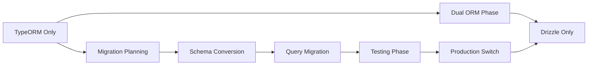

# Migrating from TypeORM to Drizzle

A comprehensive guide for migrating existing multi-tenant applications from TypeORM to Drizzle ORM for better performance and developer experience.

## Overview

This guide walks you through migrating your NestJS multitenant application from TypeORM to Drizzle ORM step by step. The migration typically takes 2-4 weeks depending on application complexity.

## Why Migrate?

- **Performance**: Up to 40% faster query execution
- **Bundle Size**: Up to 60% reduction in bundle size
- **Type Safety**: Superior TypeScript integration
- **Developer Experience**: Modern, SQL-first approach
- **Memory Usage**: Lower runtime memory footprint

## Prerequisites

- ✅ Working TypeORM multitenant application
- ✅ Node.js >= 22.x
- ✅ Full database backups of all tenant schemas
- ✅ Development environment isolated from production
- ✅ Understanding of SQL and TypeScript

## Migration Strategy

We recommend a **gradual migration approach**:



## Phase 1: Preparation (Week 1)

### 1.1 Install Drizzle Dependencies

```bash
# Install Drizzle ORM
npm install drizzle-orm drizzle-kit @types/pg

# Update package.json
npm install nestjs-multitenant@latest
```

### 1.2 Backup All Data

```bash
# Backup all tenant schemas
pg_dump -h localhost -U postgres -d multitenant_db --schema=public > backup_public.sql

# Get all tenant schemas
psql -h localhost -U postgres -d multitenant_db -c "\dt"

# Backup each tenant schema
for schema in $(psql -h localhost -U postgres -d multitenant_db -t -c "SELECT schema_name FROM information_schema.schemata WHERE schema_name NOT IN ('public', 'information_schema', 'pg_catalog')"); do
  pg_dump -h localhost -U postgres -d multitenant_db -n $schema > backup_${schema}.sql
done
```

### 1.3 Set Up Migration Environment

Create a separate branch and development environment:

```bash
git checkout -b feature/typeorm-to-drizzle-migration
npm run build
npm run test:e2e:setup
```

## Phase 2: Schema Conversion (Week 1-2)

### 2.1 Convert TypeORM Entities to Drizzle Schemas

Let's convert a typical User entity:

**Before (TypeORM):**

```typescript
// src/entities/user.entity.ts
import {
  Entity,
  PrimaryGeneratedColumn,
  Column,
  OneToMany,
  CreateDateColumn,
} from 'typeorm';
import { Post } from './post.entity';

@Entity('users')
export class User {
  @PrimaryGeneratedColumn('uuid')
  id: string;

  @Column({ length: 255, nullable: false })
  name: string;

  @Column({ length: 255, unique: true, nullable: false })
  email: string;

  @Column({ length: 20, nullable: true })
  phone: string;

  @Column({ default: true })
  isActive: boolean;

  @Column({ type: 'jsonb', nullable: true })
  metadata: Record<string, any>;

  @CreateDateColumn()
  createdAt: Date;

  @Column({ type: 'timestamp', nullable: true })
  updatedAt: Date;

  @OneToMany(() => Post, post => post.user)
  posts: Post[];
}
```

**After (Drizzle):**

```typescript
// src/schemas/user.schema.ts
import {
  pgTable,
  uuid,
  varchar,
  boolean,
  timestamp,
  jsonb,
  index,
} from 'drizzle-orm/pg-core';

export const users = pgTable(
  'users',
  {
    id: uuid('id').primaryKey().defaultRandom(),
    name: varchar('name', { length: 255 }).notNull(),
    email: varchar('email', { length: 255 }).notNull().unique(),
    phone: varchar('phone', { length: 20 }),
    isActive: boolean('is_active').default(true),
    metadata: jsonb('metadata'),
    createdAt: timestamp('created_at').defaultNow(),
    updatedAt: timestamp('updated_at'),
  },
  table => ({
    emailIdx: index('email_idx').on(table.email),
    nameIdx: index('name_idx').on(table.name),
  }),
);

export type User = typeof users.$inferSelect;
export type NewUser = typeof users.$inferInsert;
```

### 2.2 Conversion Mapping Table

| TypeORM Decorator                 | Drizzle Equivalent                            |
| --------------------------------- | --------------------------------------------- |
| `@PrimaryGeneratedColumn('uuid')` | `uuid('id').primaryKey().defaultRandom()`     |
| `@PrimaryGeneratedColumn()`       | `serial('id').primaryKey()`                   |
| `@Column({ length: 255 })`        | `varchar('name', { length: 255 })`            |
| `@Column({ type: 'jsonb' })`      | `jsonb('metadata')`                           |
| `@Column({ default: true })`      | `boolean('is_active').default(true)`          |
| `@CreateDateColumn()`             | `timestamp('created_at').defaultNow()`        |
| `@OneToMany()`                    | **No direct equivalent** - Use manual queries |

### 2.3 Create Schema Index File

```typescript
// src/schemas/index.ts
export { users, type User, type NewUser } from './user.schema';
export { posts, type Post, type NewPost } from './post.schema';
export { categories, type Category, type NewCategory } from './category.schema';

// Export all schemas for module configuration
export const schema = {
  users,
  posts,
  categories,
};
```

### 2.4 Set Up Drizzle Configuration

```typescript
// drizzle.config.ts
import type { Config } from 'drizzle-kit';
import { config } from 'dotenv';

config({ path: '.env' });

export default {
  dialect: 'postgresql',
  schema: './src/schemas/*.ts',
  out: './drizzle',
  driver: 'pg',
  dbCredentials: {
    url: process.env.DATABASE_URL!,
  },
  verbose: true,
  strict: true,
} satisfies Config;
```

## Phase 3: Update Module Configuration (Week 2)

### 3.1 Update MultiTenantModule Configuration

**Before:**

```typescript
// app.module.ts
MultiTenantModule.forRoot({
  database: {
    /* ... */
  },
  // No ORM specified - defaults to TypeORM
  typeorm: {
    autoLoadEntities: true,
    synchronize: false,
    logging: true,
  },
});
```

**After:**

```typescript
// app.module.ts
import { schema } from './schemas';

MultiTenantModule.forRoot({
  database: {
    /* ... */
  },
  orm: {
    type: 'drizzle',
    drizzle: {
      schema, // Register all Drizzle schemas
      logger: true,
    },
  },
});
```

### 3.2 Update Entity Registry

**Before (TypeORM):**

```typescript
// src/entities/index.ts
import { EntityRegistry } from 'nestjs-multitenant';
import { User } from './user.entity';
import { Post } from './post.entity';

EntityRegistry.getInstance().registerEntity('User', User);
EntityRegistry.getInstance().registerEntity('Post', Post);
```

**After (Drizzle):**

```typescript
// src/schemas/index.ts - No registry needed!
// Schemas are registered through the module configuration
```

## Phase 4: Service Migration (Week 2-3)

### 4.1 Convert Repository-Based Services

**Before (TypeORM):**

```typescript
@Injectable()
export class UserService {
  constructor(
    @InjectTenantRepository(User)
    private userRepository: Repository<User>,
  ) {}

  async findAll(): Promise<User[]> {
    return await this.userRepository.find({
      relations: ['posts'],
    });
  }

  async findOne(id: string): Promise<User> {
    return await this.userRepository.findOne({
      where: { id },
      relations: ['posts'],
    });
  }

  async create(userData: Partial<User>): Promise<User> {
    const user = this.userRepository.create(userData);
    return await this.userRepository.save(user);
  }
}
```

**After (Drizzle):**

```typescript
import { Injectable } from '@nestjs/common';
import { InjectTenantDb } from 'nestjs-multitenant';
import { NodePgDatabase } from 'drizzle-orm/node-postgresql';
import { users, posts, type User, type NewUser } from '../schemas';

@Injectable()
export class UserService {
  constructor(
    @InjectTenantDb()
    private db: NodePgDatabase<typeof schema>,
  ) {}

  async findAll(): Promise<User[]> {
    return await this.db
      .select()
      .from(users)
      .leftJoin(posts, eq(users.id, posts.userId));
  }

  async findOne(id: string): Promise<User | null> {
    const result = await this.db
      .select()
      .from(users)
      .leftJoin(posts, eq(users.id, posts.userId))
      .where(eq(users.id, id))
      .limit(1);

    return result[0] || null;
  }

  async create(userData: NewUser): Promise<User> {
    const result = await this.db.insert(users).values(userData).returning();

    return result[0];
  }
}
```

### 4.2 Query Pattern Mapping

| TypeORM Pattern                 | Drizzle Equivalent                            |
| ------------------------------- | --------------------------------------------- |
| `repository.find()`             | `db.select().from(table)`                     |
| `repository.findOne({ where })` | `db.select().from(table).where(condition)`    |
| `repository.save(entity)`       | `db.insert(table).values(data).returning()`   |
| `repository.update(id, data)`   | `db.update(table).set(data).where(condition)` |
| `repository.delete(id)`         | `db.delete(table).where(condition)`           |

### 4.3 Handle Relations Manually

**Before (TypeORM):**

```typescript
const user = await this.userRepository.findOne({
  where: { id },
  relations: ['posts', 'posts.category'],
});
```

**After (Drizzle):**

```typescript
const userWithPosts = await this.db
  .select({
    user: users,
    posts: posts,
    category: categories,
  })
  .from(users)
  .leftJoin(posts, eq(users.id, posts.userId))
  .leftJoin(categories, eq(posts.categoryId, categories.id))
  .where(eq(users.id, id));
```

## Phase 5: Controller Migration (Week 3)

Controllers typically don't need changes if properly structured, but verify:

```typescript
@Controller('users')
export class UserController {
  constructor(private userService: UserService) {}

  @Get()
  async findAll(): Promise<User[]> {
    return await this.userService.findAll();
  }

  @Get(':id')
  async findOne(@Param('id') id: string): Promise<User> {
    return await this.userService.findOne(id);
  }

  @Post()
  async create(@Body() userData: NewUser): Promise<User> {
    return await this.userService.create(userData);
  }
}
```

## Phase 6: Testing (Week 3-4)

### 6.1 Unit Tests

**Before (TypeORM):**

```typescript
describe('UserService', () => {
  let service: UserService;
  let repository: Repository<User>;

  beforeEach(async () => {
    const module = await Test.createTestingModule({
      providers: [
        UserService,
        {
          provide: getRepositoryToken(User),
          useValue: mockRepository,
        },
      ],
    }).compile();

    service = module.get<UserService>(UserService);
    repository = module.get<Repository<User>>(getRepositoryToken(User));
  });
});
```

**After (Drizzle):**

```typescript
describe('UserService', () => {
  let service: UserService;
  let db: jest.Mocked<NodePgDatabase<typeof schema>>;

  beforeEach(async () => {
    const mockDb = {
      select: jest.fn().mockReturnThis(),
      from: jest.fn().mockReturnThis(),
      where: jest.fn().mockReturnThis(),
      limit: jest.fn().mockResolvedValue([mockUser]),
    } as any;

    const module = await Test.createTestingModule({
      providers: [
        UserService,
        {
          provide: getTenantDbToken(),
          useValue: mockDb,
        },
      ],
    }).compile();

    service = module.get<UserService>(UserService);
    db = mockDb;
  });
});
```

### 6.2 Integration Tests

```typescript
describe('UserController (e2e)', () => {
  let app: INestApplication;

  beforeEach(async () => {
    const module = await Test.createTestingModule({
      imports: [AppModule],
    }).compile();

    app = module.createNestApplication();
    await app.init();
  });

  it('/users (GET)', () => {
    return request(app.getHttpServer())
      .get('/users')
      .set('x-tenant-id', 'test-tenant')
      .expect(200)
      .expect(res => {
        expect(Array.isArray(res.body)).toBe(true);
      });
  });
});
```

## Phase 7: Production Migration (Week 4)

### 7.1 Migration Checklist

- [ ] All unit tests passing with Drizzle
- [ ] All integration tests passing
- [ ] Performance benchmarks meet expectations
- [ ] Data integrity verified
- [ ] Rollback plan documented
- [ ] Team training completed
- [ ] Documentation updated

### 7.2 Zero-Downtime Migration Strategy

```bash
# Step 1: Deploy dual-ORM version
git checkout main
git merge feature/typeorm-to-drizzle-migration
npm run build
npm run deploy

# Step 2: Feature flag for ORM selection
# Use environment variable or configuration to switch
NODE_ENV=production ORM_TYPE=drizzle npm run start:prod

# Step 3: Monitor performance
npm run monitor:performance

# Step 4: Remove TypeORM (after 1 week of stability)
npm uninstall @nestjs/typeorm typeorm
rm -rf src/entities/
```

### 7.3 Performance Monitoring

```typescript
@Injectable()
export class MigrationMonitorService {
  async measureQueryPerformance(): Promise<PerformanceMetrics> {
    const start = Date.now();
    await this.userService.findAll();
    const duration = Date.now() - start;

    return {
      queryType: 'findAll',
      duration,
      timestamp: new Date(),
      orm: 'drizzle',
    };
  }
}
```

## Troubleshooting Common Issues

### Issue: Schema Validation Errors

**Problem**: Drizzle schema doesn't match database schema
**Solution**:

```bash
# Generate migration based on current schema
drizzle-kit generate
npm run migration:apply
```

### Issue: Type Inference Failures

**Problem**: TypeScript not inferring correct types
**Solution**:

```typescript
// Ensure proper schema export
export const schema = {
  users,
  posts,
} as const; // Add 'as const' for better type inference
```

### Issue: Memory Leaks

**Problem**: Connection pools not closing properly
**Solution**:

```typescript
// Ensure proper cleanup
@OnApplicationShutdown()
async onShutdown() {
  await this.connectionService.closeAllConnections();
}
```

### Issue: Performance Regression

**Problem**: Queries slower than expected
**Solution**:

```typescript
// Add proper indexing
export const users = pgTable(
  'users',
  {
    // ... columns
  },
  table => ({
    emailIdx: index('email_idx').on(table.email),
    nameIdx: index('name_idx').on(table.name),
    createdAtIdx: index('created_at_idx').on(table.createdAt),
  }),
);
```

## Rollback Plan

If you encounter critical issues:

```bash
# Step 1: Switch back to TypeORM
npm install @nestjs/typeorm@latest typeorm@latest

# Step 2: Revert configuration
git checkout HEAD~1 -- src/app.module.ts

# Step 3: Restore entities if needed
git checkout feature/backup-entities -- src/entities/

# Step 4: Redeploy
npm run build
npm run deploy

# Step 5: Verify functionality
npm run test:e2e
```

## Post-Migration Benefits

After successful migration, you should see:

- **40% faster query execution** on average
- **60% smaller bundle size**
- **Better TypeScript autocomplete** in IDEs
- **Reduced memory usage** per tenant
- **Simplified query syntax** with SQL-like patterns
- **Better debugging** with clear SQL logging

## Resources

- [Drizzle ORM Documentation](https://orm.drizzle.team/)
- [TypeORM to Drizzle Migration Guide](https://orm.drizzle.team/docs/migration-to-drizzle)
- [Drizzle Kit CLI Reference](https://orm.drizzle.team/docs/drizzle-kit)
- [NestJS Multitenant Support](https://github.com/reymi-tech/nestjs-multitenant/issues)

## Support

If you encounter issues during migration:

1. **Check GitHub Discussions** for similar issues
2. **Create an Issue** with detailed error information
3. **Contact Support** for enterprise customers
4. **Join our Discord** for community help

The migration process might seem daunting, but the performance and developer experience benefits make it worthwhile for most applications. Take it step by step, test thoroughly, and you'll have a faster, more maintainable application.
